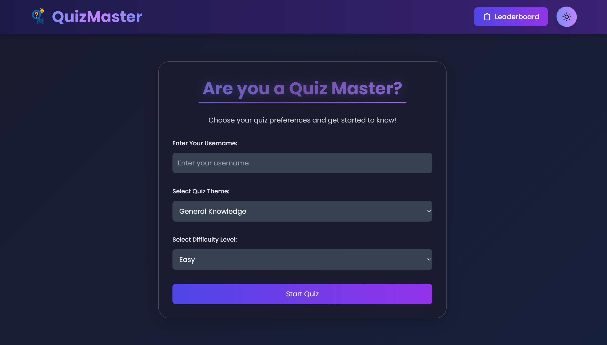
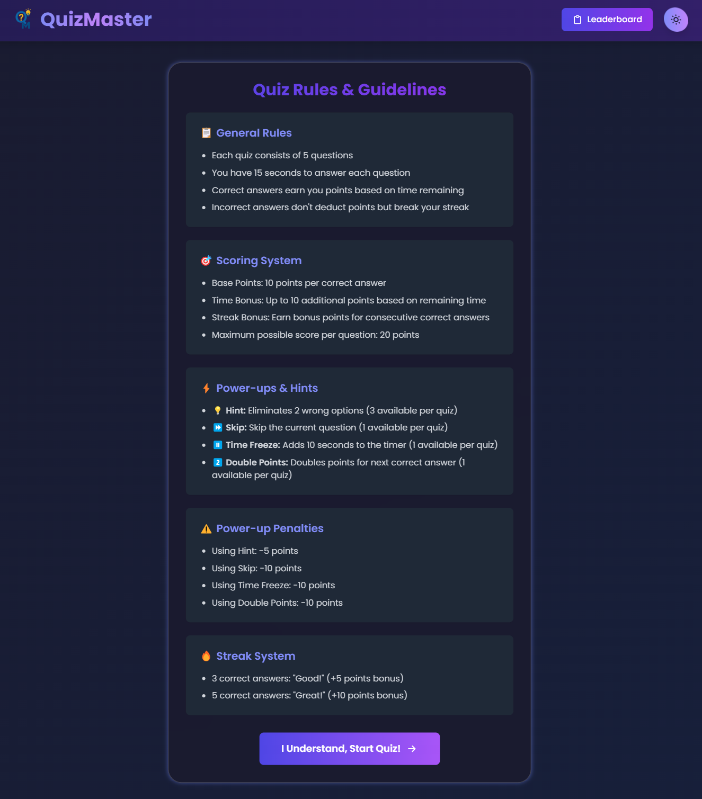
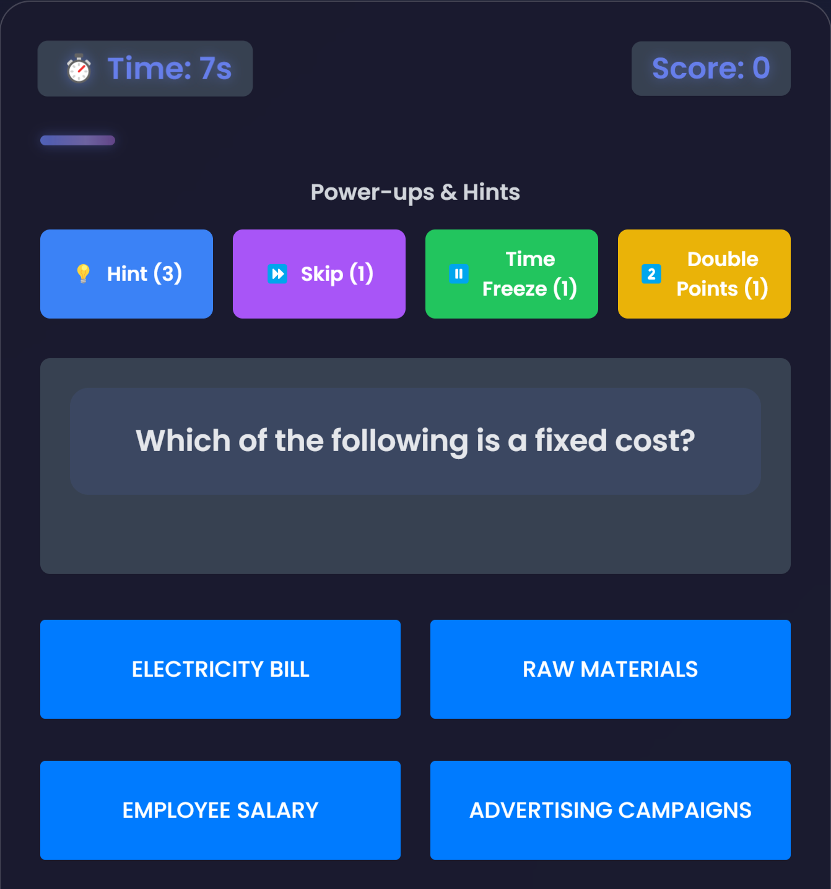
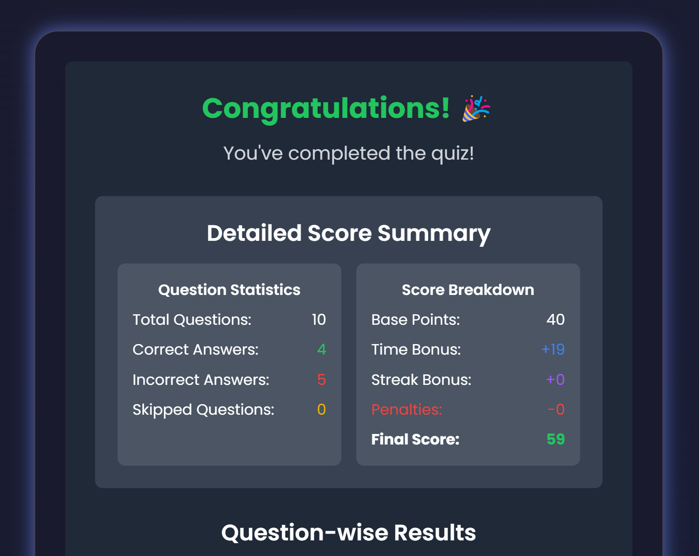
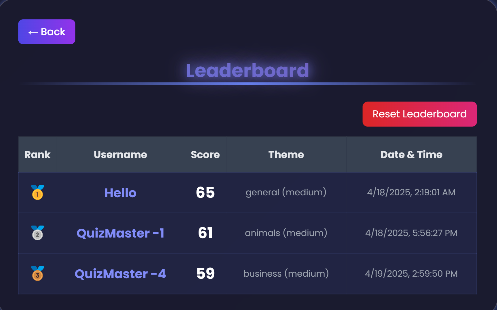

# Quiz Master

A modern, interactive quiz application with beautiful UI, built for learning and fun.

## Application Screenshots

### Home Page


### Quiz Rules


### Quiz Interface


### Results Page


### Leaderboard


## Features

- **Beautiful UI** with modern gradient backgrounds and animations
- **Responsive design** that works on desktop, tablet, and mobile devices
- **Interactive quizzes** with multiple-choice questions
- **5 questions per quiz** for quick and engaging sessions
- **Real-time feedback** on correct and incorrect answers
- **Timer** for each question to add pressure and excitement
- **Score tracking** with animated scoring system
- **Progress bar** to show quiz completion status
- **Leaderboard** to compare scores with other players
- **Statistics** to track performance over time
- **Categories** of questions to choose from
- **Dark mode** support for comfortable night-time use
- **Animations and transitions** throughout the app for a polished feel
- **Mobile-first design** with landscape mode support

## Technologies Used

- HTML5
- CSS3 (with animations, transitions, and responsive design)
- JavaScript (ES6+)
- LocalStorage for saving scores and settings

## Demo

Check out the live demo: [Quiz Master Demo](https://quiz-master-lac.vercel.app/)

## Setup and Installation

1. Clone the repository:
   ```
   git clone https://github.com/devSidd2006/Quiz_Master.git
   ```

2. Navigate to the project directory:
   ```
   cd Quiz_Master
   ```

3. Open `index.html` in your browser or use a local development server:
   ```
   # Using Python
   python -m http.server
   
   # Using Node.js
   npx serve
   ```

4. The application should now be running at `http://localhost:8000` or similar.

## Project Structure

```
Quiz_Master/
├── index.html          # Main HTML file
├── styles.css          # CSS styles with animations and responsive design
├── scripts/            # JavaScript files
│   ├── app.js          # Main application logic
│   ├── questions.js    # Question data management
│   ├── timer.js        # Timer functionality
│   └── leaderboard.js  # Leaderboard functionality
├── assets/             # Images, icons, and other assets
│   ├── images/         # Images used in the application
│   └── fonts/          # Custom fonts
└── README.md           # Project documentation
```

## How to Play

1. Start by entering your name and selecting a quiz category
2. Read each question carefully and select your answer before the timer runs out
3. Receive immediate feedback on whether your answer was correct
4. Continue through all questions to complete the quiz
5. View your final score and statistics at the end
6. Check the leaderboard to see how you rank against other players
7. Play again to improve your score!

## Customization

- **Dark Mode**: Toggle between light and dark mode using the theme toggle
- **Categories**: Choose from various quiz categories
- **Difficulty**: Select your preferred difficulty level

## Browser Support

Quiz Master works on all modern browsers including:
- Chrome
- Firefox
- Safari
- Edge

## Performance

The application is optimized for performance:
- Minimal dependencies
- Optimized animations
- Responsive images
- Fast loading times

## Contributing

Contributions are welcome! Please feel free to submit a Pull Request.

1. Fork the repository
2. Create your feature branch (`git checkout -b feature/amazing-feature`)
3. Commit your changes (`git commit -m 'Add some amazing feature'`)
4. Push to the branch (`git push origin feature/amazing-feature`)
5. Open a Pull Request


## Contact


Project Link: [https://github.com/devSidd2006/Quiz_Master](https://github.com/devSidd2006/Quiz_Master)

## Acknowledgements

- [Font Awesome](https://fontawesome.com) for icons
- [Google Fonts](https://fonts.google.com/) for typography 
